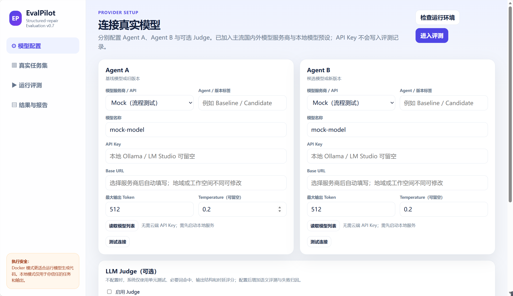
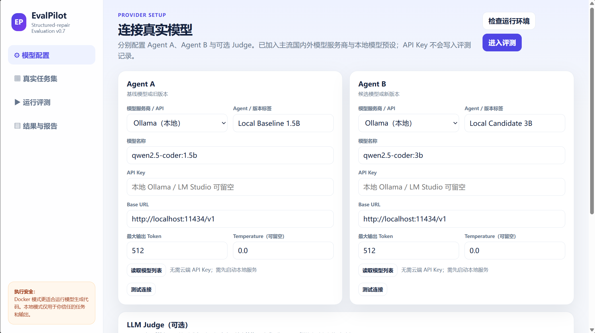
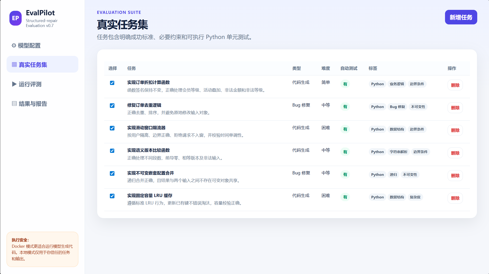
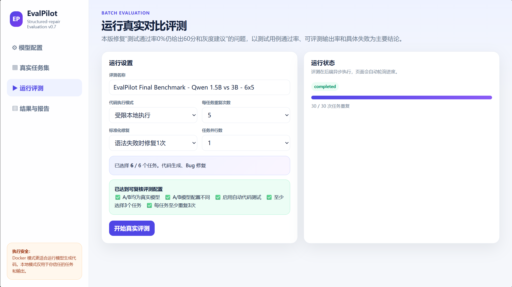
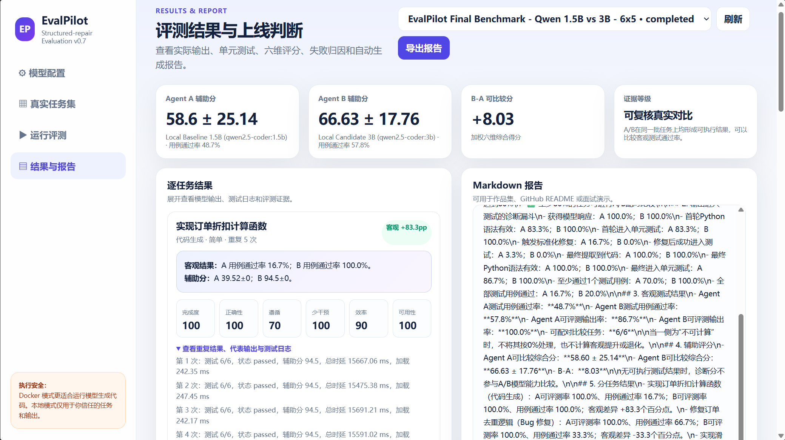
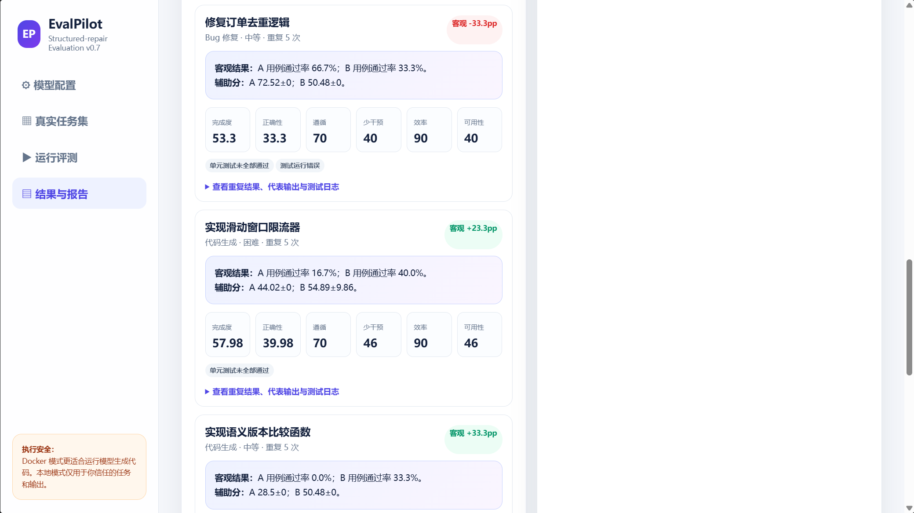

# EvalPilot

**Evidence-first evaluation and failure-diagnosis workbench for AI coding agents**

EvalPilot is a lightweight evaluation platform for comparing AI coding agents under the same task set, execution environment, and test suite. It connects real local models, executes generated Python code in a restricted environment, runs unit tests, diagnoses failures, and exports reproducible Markdown and JSON evidence.

## Highlights

- Real A/B model evaluation through Ollama
- Repeated benchmark runs on the same task set
- Restricted local Python execution
- Unit-test-based objective scoring
- Output evaluability and execution funnel diagnostics
- Placeholder, path-like, and empty JSON output detection
- Standardized repair for invalid outputs
- Markdown and JSON evidence export
- Failure attribution across syntax, import, runtime, assertion, and tool errors

## Final benchmark

- Agent A: Qwen2.5-Coder 1.5B
- Agent B: Qwen2.5-Coder 3B
- Tasks: 6 Python coding and bug-fix tasks
- Repeats: 5 per task
- Base model calls: 60
- Max output tokens: 512
- Temperature: 0.0
- Standardized repair attempts: 1
- Judge: Disabled

### Results

| Metric | Qwen2.5-Coder 1.5B | Qwen2.5-Coder 3B |
|---|---:|---:|
| Evaluable output rate | 86.7% | 100.0% |
| Test-case pass rate | 48.7% | 57.8% |
| At least one test passed | 70.0% | 100.0% |
| All tests passed | 16.7% | 20.0% |

Under this benchmark configuration, the 3B model achieved a 9.1 percentage-point higher test-case pass rate. Performance differed by task, so this result should be interpreted as a configuration-specific model-selection signal rather than a universal ranking.

## Product workflow

```text
Model configuration
-> Task selection
-> Repeated A/B runs
-> Code extraction
-> Syntax and entry-point validation
-> Restricted local execution
-> Unit tests
-> Failure diagnosis
-> Markdown and JSON evidence export
```

## Key product decisions

- Objective unit-test results take priority over heuristic scores.
- "Not executed" is treated as missing evidence, not as a 0% test result.
- Placeholder text, file paths, and empty JSON wrappers are rejected as invalid code.
- First-pass quality and repair outcomes are reported separately.
- Evidence levels depend on evaluability and paired comparability.
- Conclusions are limited to the current task set, prompts, parser, models, and local execution environment.

## Repository structure

```text
evalpilot-agent-evaluation/
|-- README.md
|-- .gitignore
|-- app.py
|-- requirements.txt
|-- start_windows.bat
|-- start_unix.sh
|-- static/
|   `-- index.html
|-- data/
|   `-- tasks.json
|-- evidence/
|   |-- evaluation_report_public.md
|   `-- run_result_public.json
`-- screenshots/
    |-- 01_model_configuration.png
    |-- 02_task_suite.png
    |-- 03_task_suite.png
    |-- 04_diagnostic_funnel.png
    |-- 05_benchmark_results.png
    `-- 06_failure_diagnosis.png
```

## Product screenshots

### Model configuration



### Task suite



### Evaluation setup



### Diagnostic funnel



### Benchmark results



### Failure diagnosis



## Reproducible evidence

- [Final evaluation report](evidence/evaluation_report_public.md)
- [Sanitized raw run JSON](evidence/run_result_public.json)

The public evidence files are sanitized copies. Personal paths, usernames, credentials, phone numbers, and email addresses are not included.

## Local reproduction

### Requirements

- Python 3.12
- Ollama
- Qwen2.5-Coder 1.5B
- Qwen2.5-Coder 3B

### 1. Clone the repository

```bash
git clone https://github.com/hrt-camellia/evalpilot-agent-evaluation.git
cd evalpilot-agent-evaluation
```

### 2. Pull the Ollama models

```bash
ollama pull qwen2.5-coder:1.5b
ollama pull qwen2.5-coder:3b
ollama list
```

### 3. Create a Python environment

Windows PowerShell:

```powershell
python -m venv .venv
.\.venv\Scripts\Activate.ps1
python -m pip install --upgrade pip
python -m pip install -r requirements.txt
```

macOS or Linux:

```bash
python3 -m venv .venv
source .venv/bin/activate
python -m pip install --upgrade pip
python -m pip install -r requirements.txt
```

### 4. Start EvalPilot

```bash
python -m uvicorn app:app --host 127.0.0.1 --port 8000
```

Open:

```text
http://127.0.0.1:8000
```

### 5. Configure the benchmark

Agent A:

```text
Provider: Ollama
Model: qwen2.5-coder:1.5b
Max output tokens: 512
Temperature: 0.0
```

Agent B:

```text
Provider: Ollama
Model: qwen2.5-coder:3b
Max output tokens: 512
Temperature: 0.0
```

Recommended configuration:

```text
Execution mode: Restricted local execution
Tasks: 6
Repeats per task: 5
Standardized repair attempts: 1
Parallelism: 1
Judge: Disabled
```

## Reproducibility note

Exact results may vary with the operating system, Ollama version, model build, hardware, prompt formatting, parser behavior, and local execution environment. The public report and sanitized JSON record the configuration and outputs used for the reported benchmark.

## Project status

- MVP development: completed
- Real model integration: completed
- Evaluation logic hotfix: completed
- Compatibility validation: completed
- Final 6-task x 5-run benchmark: completed
- Public evidence package: completed
